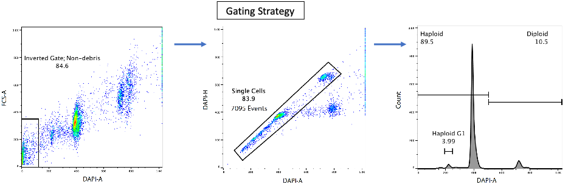

# Ploidy assay

## Nocodazole treatment

### Materials
1)	IMDM (Life Tech 12440053 or 21980065)
2)	Heat-inactivated FBS (Gibco 10500-064)
3)	Nocodazole (Biovision B1874-5)

**Day -1**

Seed 2X T75 for ploidy assay. 4M cell in 15mL medium (IMDM + 10%FBS) per flask. (For ethanol fixation and FACS).

**Day 0**
 
1uL stock was added to 99uL of medium (IMDM+10% FBS). 20uL of diluted nocodazole was added to 20mL of medium (IMDM+10%FBS).  15mL of noco + medium to a T75. Keep another T75 as control. Incubate 12 to 14 hours. (usually, I do this in the evening)

Nocodazole dilution: 100,000 times 
Stock: 5mg in 1.66mL DMSO, 10mM

## Fixation

Reagent: Store 80% ethanol (400mL Ethanol, 100mL water) in -20C freezer for at least 12 hr before fixation.

**Day 1** (Try to start with at least 4M cell, you will lose a lot of cell in the process.)

T75 Flask:  
I.         Wash once with PBS. 
II.        Added 2mL of TrypLe express and incubated for 3 min at 37C. 
III.       Added 8mL of FBS+ medium. Spin at 250g for 5min, RT. 
IV.        Resuspend the cell pellet in 8mL of PBS. Cell counting.  
V.         Resuspend in 500uL* PBS. Pipette up and down to break the doublet cell as much as possible.  
*cell concentration: 1-10M/500uL, usually 5-9M cell per 500uL is good. 
VI.        Add cell drop by drop to 5mL cold (-20C) 80% ethanol with vortexing. 
VII.       Incubated on ice for at least 30min and keep in 4C fridge or start with Part 3 immediately. The fixed sample can be kept in 4C for at most 2 weeks. 

## Staining

### Materials
1)	PBS 
2)	TritonX-100
3)	10mg/mL DAPI

DAPI staining:
1)	Add 10mL of PBS to 5-6mL of ethanol-fixed cell. Spin at 3000RPM, 10min, RT
2)	Add 1mL of PBS to cell pellet and break the cell pellet gently by P1000 pipette. Pipetting up and down until no visible cell clump. Add another 9mL of PBS. Spin at 2000RPM, 10min, RT.
3)	Add 500uL to 1mL of 0.1% TritonX-100/PBS (depend on estimated cell number, final cell concentration after filtering must be more than 1M/mL with volume more than 300uL). Break the cell pellet gently by pipetting up and down,
4)	Pass through the cell on 40um cell strainer. 
5)	Count cell. (Not necessary to be very accurate. No trypan blue)
6)	Add 500uL of 0.1% TritonX-100/PBS to a 5mL FACS tube. Remove the volume of 500K cell and add 500K cell to the tube. The tube should have 500uL of 500K cell at the end. 
Or by any way that you like, such that you will have 500k cell in 500uL of 0.1% TritonX-100/PBS.
7)	Add 0.5uL of DAPI (stock: 1mg/mL) to the tube. Mix well. Incubate in the dark, RT for at least 30min.
8)	FACS.  
**Important**: DO NOT remove the staining solution from the sample. The dye-DNA interaction is reversible.

## FACS Gating strategy

